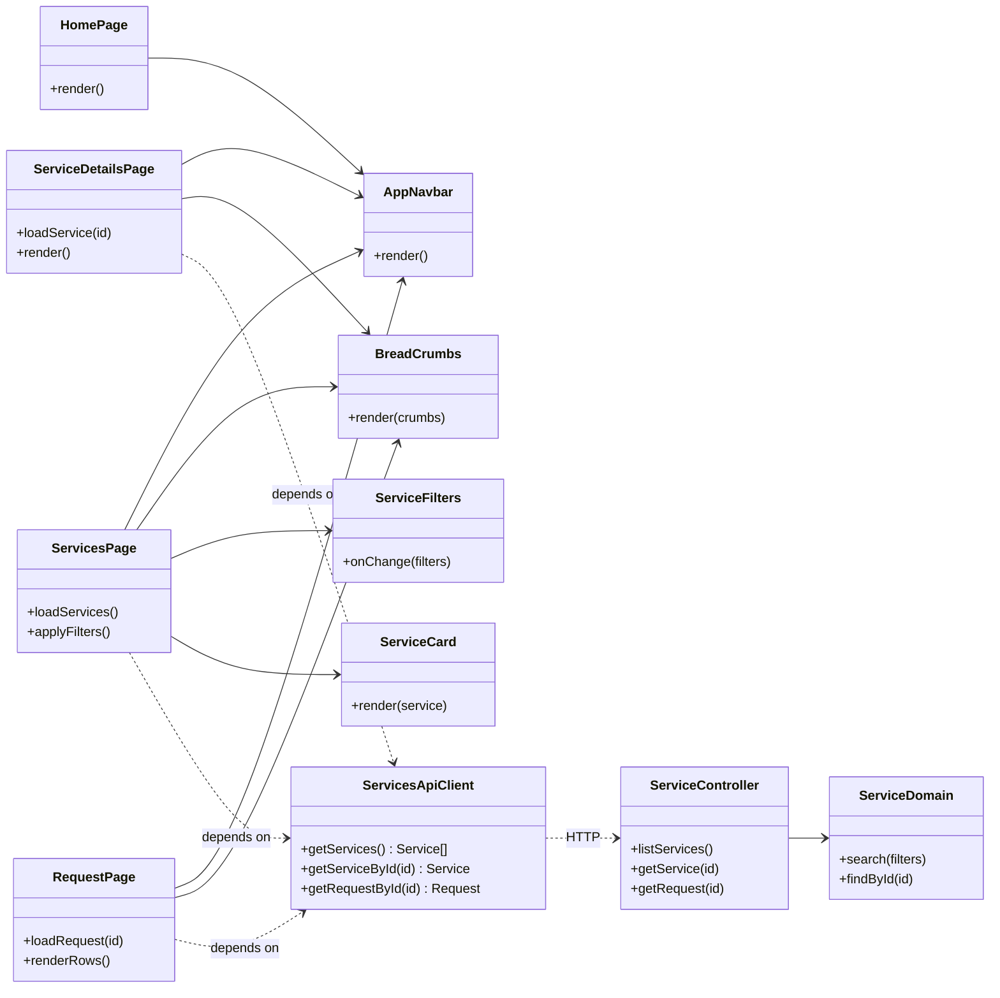

# Диаграмма классов (Frontend + Backend домены)

```mermaid
classDiagram
  direction LR

  class HomePage {
    +render()
  }

  class ServicesPage {
    +loadServices()
    +applyFilters()
  }

  class ServiceDetailsPage {
    +loadService(id)
    +render()
  }

  class RequestPage {
    +loadRequest(id)
    +renderRows()
  }

  class AppNavbar {
    +render()
  }

  class BreadCrumbs {
    +render(crumbs)
  }

  class ServiceFilters {
    +onChange(filters)
  }

  class ServiceCard {
    +render(service)
  }

  class ServicesApiClient {
    +getServices() Service[]
    +getServiceById(id) Service
    +getRequestById(id) Request
  }

  class ServiceController {
    +listServices()
    +getService(id)
    +getRequest(id)
  }

  class ServiceDomain {
    +search(filters)
    +findById(id)
  }

  HomePage --> AppNavbar
  ServicesPage --> AppNavbar
  ServiceDetailsPage --> AppNavbar
  RequestPage --> AppNavbar

  ServicesPage --> BreadCrumbs
  ServiceDetailsPage --> BreadCrumbs
  RequestPage --> BreadCrumbs

  ServicesPage --> ServiceFilters
  ServicesPage --> ServiceCard

  ServicesPage ..> ServicesApiClient : depends on
  ServiceDetailsPage ..> ServicesApiClient : depends on
  RequestPage ..> ServicesApiClient : depends on

  ServicesApiClient ..> ServiceController : HTTP
  ServiceController --> ServiceDomain
```

Диаграмма без моделей и БД, с фокусом на домены и методы.
