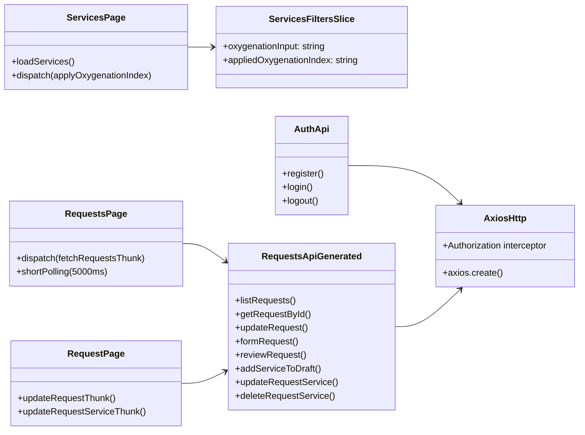

# Class Diagram (актуальная версия)

```mermaid
classDiagram
  direction LR

  class ServicesPage {
    +loadServices()
    +dispatch(applyOxygenationIndex)
  }

  class RequestsPage {
    +dispatch(fetchRequestsThunk)
    +shortPolling(5000ms)
  }

  class RequestPage {
    +updateRequestThunk()
    +updateRequestServiceThunk()
  }

  class ServicesFiltersSlice {
    +oxygenationInput: string
    +appliedOxygenationIndex: string
  }

  class RequestsApiGenerated {
    +listRequests()
    +getRequestById()
    +updateRequest()
    +formRequest()
    +reviewRequest()
    +addServiceToDraft()
    +updateRequestService()
    +deleteRequestService()
  }

  class AuthApi {
    +register()
    +login()
    +logout()
  }

  class AxiosHttp {
    +axios.create()
    +Authorization interceptor
  }

  ServicesPage --> ServicesFiltersSlice
  RequestsPage --> RequestsApiGenerated
  RequestPage --> RequestsApiGenerated
  AuthApi --> AxiosHttp
  RequestsApiGenerated --> AxiosHttp
```

Подробные диаграммы deployment/state/use-case: `docs/lab8-diagrams.md`.
