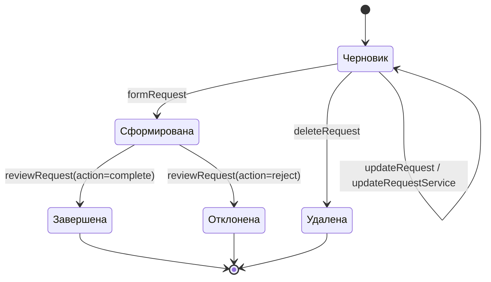
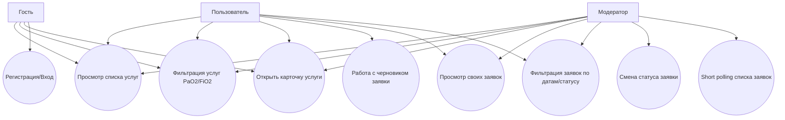

# Лабораторная 8 — диаграммы

## 1. Deployment диаграмма

```mermaid
flowchart LR
  subgraph ClientDevices[Клиентские устройства]
    Phone[PWA на телефоне]
    Browser[Браузер на ПК]
    Tauri[Tauri build на ПК]
  end

  subgraph FrontHosts[Узлы фронтенда]
    Pages[GitHub Pages\nстатические файлы]
    DevServer[Vite dev server (HTTPS :3000)]
  end

  subgraph BackendNode[Узел backend]
    API[Web-service API\n:8080]
    Minio[MinIO / статические медиа\n:9000]
    DB[(PostgreSQL)]
  end

  Phone -->|HTTPS| Pages
  Browser -->|HTTPS| Pages
  Browser -->|HTTPS| DevServer
  Tauri -->|HTTP REST| API

  Pages -->|HTTP /api proxy или прямые API вызовы| API
  DevServer -->|HTTP /api proxy| API
  Pages -->|HTTP /img-proxy| Minio
  DevServer -->|HTTP /img-proxy| Minio
  API -->|SQL| DB
```

## 2. Диаграмма состояний заявки



## 3. Диаграмма прецедентов React интерфейса


